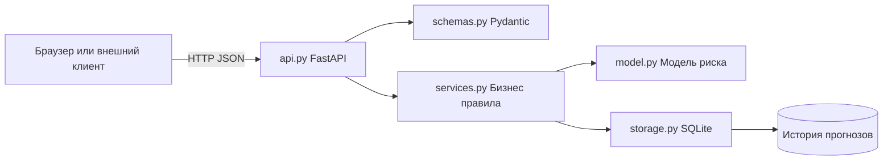

# MOEX Risk API

REST API оценки риска акций Московской биржи на FastAPI.

Сервис принимает показатели акции, рассчитывает объяснимый балл риска,
сохраняет результат в SQLite и предоставляет историю через REST API и веб-страницу.
Модель — детерминированная формула с заданными весами, а не обученная ML-модель.
Примеры данных вымышлены; сервис не загружает текущие котировки и не даёт советов о покупке.

## Быстрый запуск

Нужен Python 3.12+ (проверено на 3.12). На Windows:

1. Скачайте репозиторий или выполните `git clone https://github.com/SkyLineDY/moex-risk-api.git`.
2. Запустите `setup.cmd` один раз. Ожидается `Setup complete`.
3. Запустите `run.cmd` и оставьте окно работающим.
4. Откройте http://127.0.0.1:8001 — форма и история; http://127.0.0.1:8001/docs — Swagger UI.
5. Нажмите «Рассчитать и сохранить»: ожидаются HTTP 201, балл **0.185**, категория **low**.

По умолчанию сервер использует порт 8001.
Остановка: Ctrl+C в окне сервера. GitHub хранит исходники; публикация репозитория сама по себе не запускает API в интернете.

Ручная установка (Windows PowerShell):

```powershell
py -3.12 -m venv .venv
.\.venv\Scripts\python.exe -m pip install -r requirements-lock.txt
.\.venv\Scripts\python.exe main.py
```

Linux/macOS:

```bash
python3 -m venv .venv
.venv/bin/python -m pip install -r requirements-lock.txt
.venv/bin/python main.py
```

`requirements.txt` — прямые зависимости приложения; `requirements-dev.txt` добавляет тесты;
`requirements-lock.txt` фиксирует полное окружение проверенного запуска, включая тестовые зависимости.
Для воспроизводимости используйте lock-файл. Если порт занят, можно выполнить
`python -m uvicorn main:app --host 127.0.0.1 --port 8002` из активированного окружения.

## API

| Метод | Путь | Назначение | Успех | Ожидаемые ошибки |
|---|---|---|---|---|
| GET | `/health` | Готовность модели и SQLite | 200 | 503 |
| GET | `/model-info` | Версия, признаки и пороги модели | 200 | — |
| POST | `/predict` | Расчёт и создание сохранённого результата | 201 | 400, 422, 503 |
| GET | `/predictions/{request_id}` | Поиск по UUID | 200 | 404, 422, 503 |
| GET | `/predictions` | История, фильтры и пагинация | 200 | 422, 503 |
| GET | `/instruments` | Справочник поддерживаемых тикеров | 200 | — |

Непредвиденная программная ошибка может привести к HTTP 500.
Параметры истории: `limit` от 1 до 100 (по умолчанию 10), `offset` от 0,
`risk_level` = `low`, `medium` или `high`, `ticker`.
Сортировка — новые записи первыми. Фильтры применяются до пагинации.
Каждый POST создаёт новый UUID; повторный одинаковый POST создаёт отдельную запись.
HTTP 201 выбран потому, что создаётся ресурс; заголовок `Location` содержит адрес этого ресурса.
Некорректный UUID даёт 422, корректный отсутствующий UUID — 404.

Пример для PowerShell:

```powershell
$body = Get-Content -Raw -Encoding UTF8 examples/low.json
$prediction = Invoke-RestMethod http://127.0.0.1:8001/predict -Method Post -ContentType 'application/json' -Body $body
$prediction
Invoke-RestMethod "http://127.0.0.1:8001/predictions/$($prediction.request_id)"
Invoke-RestMethod 'http://127.0.0.1:8001/predictions?risk_level=low&limit=2'
```

## Входные показатели и ограничения

| Поле | Значение и диапазон |
|---|---|
| `ticker` | Тикер из справочника: SBER, GAZP, LKOH, MOEX, GMKN |
| `board` | Только TQBR; значение по умолчанию TQBR |
| `annual_volatility_pct` | Годовая волатильность, 0–300% |
| `max_drawdown_pct` | Максимальная просадка за период, 0–100% |
| `avg_daily_turnover_mrub` | Средний дневной оборот, 0–1 000 000 млн руб. |
| `bid_ask_spread_pct` | Спред, 0–100% |
| `observation_days` | Целое число торговых дней, 20–252 |

Границы — ограничения контракта сервиса, не правила биржи. `observation_days` фиксирует
длину выборки и проверяет её минимальную достаточность; сама длина выборки в формулу не входит.
Клиент должен вычислять просадку и средний оборот за один период. API не проверяет достоверность
переданных показателей. Код тикера и режима нормализуется в верхний регистр.
Неизвестный тикер или неподдерживаемый режим дают 400, нарушение схемы — 422.
Лишние поля и нечисловые значения NaN/Infinity запрещены.

## Модель оценки риска

```text
V = min(annual_volatility_pct / 80, 1)
D = min(max_drawdown_pct / 60, 1)
L = 1 - min(avg_daily_turnover_mrub / 100, 1)
S = min(bid_ask_spread_pct / 2, 1)
risk_score = round(0.4*V + 0.3*D + 0.2*L + 0.1*S, 6)
```

Категории: `low` при балле < 0.35, `medium` при 0.35 ≤ балл < 0.65,
`high` при балле ≥ 0.65. Категория определяется по возвращаемому округлённому баллу.
Веса и пороги заданы вручную и не калиброваны по рынку. Балл не является
вероятностью убытка. Каждый ответ содержит входные данные, четыре вклада факторов,
версию модели, UTC-время и UUID. Вклад каждого фактора округляется отдельно до 6 знаков,
поэтому сумма отображаемых вкладов может отличаться от итогового балла на несколько миллионных.

Для `examples/low.json`: 0.4×0.3 + 0.3×0.2 + 0.2×0 + 0.1×0.05 = **0.185**.
Для `examples/high.json`: **0.965**, `high`.
Имена тикеров отражают выбранную предметную область; справочник фиксированный,
он не подтверждает актуальный состав торгов на конкретную дату.

## Архитектура



Запрос проходит структурную проверку Pydantic, проверку справочника, расчёт,
постпроцессинг и сохранение. Ответ выдаётся после успешной записи.
Обработчики с SQLite и вычислениями синхронные (`def`), FastAPI исполняет их вне основного
цикла событий; middleware измерения времени асинхронный.
Обучение модели и массовое обновление данных в текущей версии не реализованы:
для них в развитой системе нужны отдельные фоновые задания, а не длительный `/predict`.

`data/predictions.sqlite3` создаётся автоматически. Каждая операция использует отдельное
соединение и параметризованный SQL. История сохраняется после перезапуска, но файл БД
не публикуется в Git. Для иной БД задайте `MOEX_DB_PATH`.
`MOEX_MODEL_READY=0` моделирует недоступность модели: `/health` и `/predict` вернут 503.
Ошибки доступа к хранилищу также возвращают 503 без раскрытия внутреннего пути.
При невозможности создать БД во время запуска приложение не запускается.

Логи содержат метод, путь, HTTP-код, длительность и идентификатор HTTP-запроса.
`X-Request-ID` идентифицирует конкретный HTTP-запрос; `request_id` в JSON — сохранённую оценку.
Входные финансовые показатели в лог не записываются.

## Проверка

Запустите `test.cmd` или `.venv\Scripts\python.exe -m pytest -q`.
Проверены **36 тестов**: контракт, расчёт и пороги, структурная и бизнес-валидация,
поиск, сортировка, фильтры, пагинация, недоступность модели/БД, сохранение после перезапуска.
Есть предупреждение библиотеки Starlette об устаревающем использовании httpx в TestClient;
оно не влияет на результат проверенного набора версий.
GitHub Actions запускает тот же набор тестов при push и pull request.

При работающем сервере `python scripts/verify_live.py` воспроизводит 12 HTTP-проверок
и обновляет `artifacts/test-results.json`. Этот сценарий создаёт одну запись в локальной истории.
Скрипт `scripts/capture_browser.cjs` проверяет интерфейс и Swagger через Playwright и Chrome;
снимки сохраняются локально в `artifacts/screenshots/`.

## Возможности

- Оценка риска акций по волатильности, просадке, обороту и спреду.
- Код разделён на API, схемы, модель, бизнес-логику и хранилище.
- Сохранение истории в SQLite, фильтр тикера и пагинация.
- Ответ содержит объяснение балла, исходные данные, время и версию модели.
- Добавлены веб-интерфейс, тесты, GitHub Actions и готовые примеры JSON.

Прототип рассчитан на локальную демонстрацию. Для эксплуатации потребуются авторизация,
ограничение частоты запросов, управление версиями схемы и мониторинг, а также валидация
модели на исторических данных. SQLite подходит для небольшой нагрузки; при большом количестве
одновременных записей нужен сервер БД. Интеграция ISS предполагается как отдельный адаптер
с контролем периода, пропусков, корпоративных действий и происхождения данных.

## Источники

- FastAPI: https://fastapi.tiangolo.com/tutorial/testing/ и https://fastapi.tiangolo.com/tutorial/response-status-code/.
- Официальное описание ISS Московской биржи: https://www.moex.com/a2193.
  Это источник сведений о возможной будущей интеграции, не источник демонстрационных чисел.

Лицензия MIT, исходный файл LICENSE репозитория сохранён.
